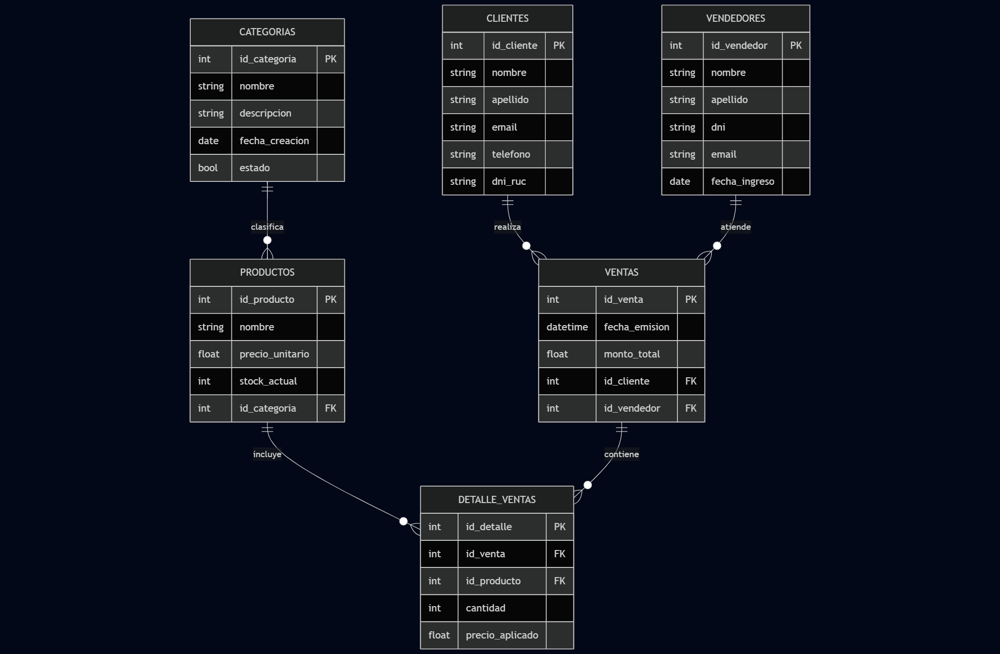
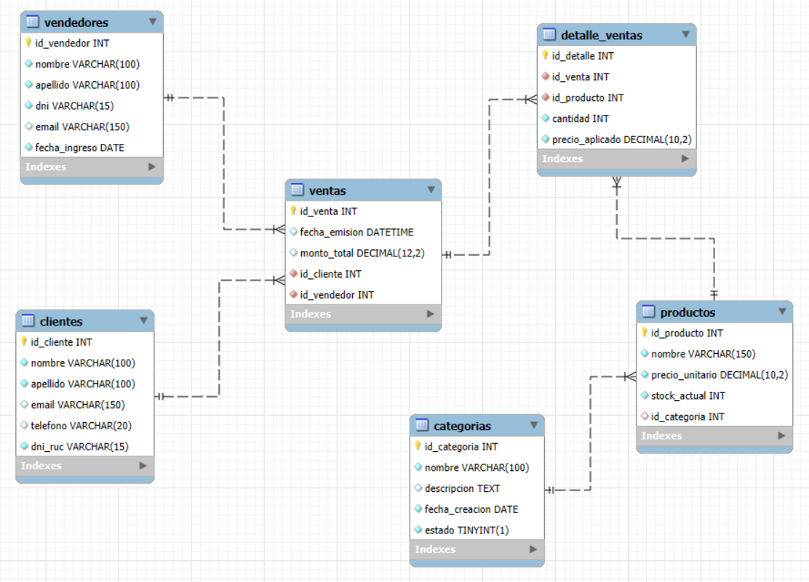

# Caso de Uso: Sistema de Gestión de Ventas
Este documento contiene el análisis, modelado y script de creación para una base de datos transaccional (OLTP) diseñada para una tienda.

## 1. Análisis de Requerimientos

El sistema busca automatizar el flujo de ventas de una tienda. Los requerimientos principales son:
* **Gestión de Inventario:** Clasificar productos por categorías.
* **Gestión de Clientes:** Almacenar datos de contacto y documentos de identidad.
* **Gestión de Personal:** Registrar a los vendedores responsables de cada transacción.
* **Control de Ventas:** Registrar la cabecera de la venta (fecha, cliente, vendedor) y el detalle pormenorizado (productos, cantidades y precios históricos).

---

## 2. Modelado de Datos

### A. Modelo Conceptual
Se definen las siguientes entidades y relaciones:
* Una **Categoría** puede tener muchos **Productos**.
* Un **Producto** pertenece a una sola **Categoría**.
* Un **Cliente** puede realizar múltiples **Ventas**.
* Un **Vendedor** puede procesar múltiples **Ventas**.
* Una **Venta** se compone de varios **Detalles de Venta**.
* Un **Producto** puede aparecer en muchos **Detalles de Venta**.

### B. Modelo Lógico y Físico
A continuación se detallan las entidades con sus respectivos atributos:
1.  **Categorias**: `id_categoria` (PK), `nombre`, `descripcion`, `fecha_creacion`, `estado`.
2.  **Productos**: `id_producto` (PK), `nombre`, `precio_unitario`, `stock_actual`, `id_categoria` (FK).
3.  **Clientes**: `id_cliente` (PK), `nombre`, `apellido`, `email`, `telefono`, `dni_ruc`.
4.  **Vendedores**: `id_vendedor` (PK), `nombre`, `apellido`, `dni`, `email`, `fecha_ingreso`.
5.  **Ventas**: `id_venta` (PK), `fecha_emision`, `monto_total`, `id_cliente` (FK), `id_vendedor` (FK).
6.  **Detalle_Ventas**: `id_detalle` (PK), `id_venta` (FK), `id_producto` (FK), `cantidad`, `precio_aplicado`.



---

## 3. Script de Creación de la Base de Datos (MySQL)

```sql
CREATE DATABASE IF NOT EXISTS gestion_tienda;
USE gestion_tienda;

CREATE TABLE categorias (
    id_categoria INT AUTO_INCREMENT PRIMARY KEY,
    nombre VARCHAR(100) NOT NULL,
    descripcion TEXT,
    fecha_creacion DATE NOT NULL,
    estado TINYINT(1) NOT NULL
);

CREATE TABLE productos (
    id_producto INT AUTO_INCREMENT PRIMARY KEY,
    nombre VARCHAR(150) NOT NULL,
    precio_unitario DECIMAL(10,2) NOT NULL,
    stock_actual INT NOT NULL,
    id_categoria INT,
    CONSTRAINT fk_producto_categoria FOREIGN KEY (id_categoria) REFERENCES categorias(id_categoria)
);

CREATE TABLE clientes (
    id_cliente INT AUTO_INCREMENT PRIMARY KEY,
    nombre VARCHAR(100) NOT NULL,
    apellido VARCHAR(100) NOT NULL,
    email VARCHAR(150) UNIQUE,
    telefono VARCHAR(20),
    dni_ruc VARCHAR(15) NOT NULL UNIQUE
);

CREATE TABLE vendedores (
    id_vendedor INT AUTO_INCREMENT PRIMARY KEY,
    nombre VARCHAR(100) NOT NULL,
    apellido VARCHAR(100) NOT NULL,
    dni VARCHAR(15) NOT NULL UNIQUE,
    email VARCHAR(150),
    fecha_ingreso DATE NOT NULL
);

CREATE TABLE ventas (
    id_venta INT AUTO_INCREMENT PRIMARY KEY,
    fecha_emision DATETIME DEFAULT CURRENT_TIMESTAMP,
    monto_total DECIMAL(12,2) DEFAULT 0.00,
    id_cliente INT NOT NULL,
    id_vendedor INT NOT NULL,
    CONSTRAINT fk_venta_cliente FOREIGN KEY (id_cliente) REFERENCES clientes(id_cliente),
    CONSTRAINT fk_venta_vendedor FOREIGN KEY (id_vendedor) REFERENCES vendedores(id_vendedor)
);

CREATE TABLE detalle_ventas (
    id_detalle INT AUTO_INCREMENT PRIMARY KEY,
    id_venta INT NOT NULL,
    id_producto INT NOT NULL,
    cantidad INT NOT NULL,
    precio_aplicado DECIMAL(10,2) NOT NULL,
    CONSTRAINT fk_detalle_venta FOREIGN KEY (id_venta) REFERENCES ventas(id_venta),
    CONSTRAINT fk_detalle_producto FOREIGN KEY (id_producto) REFERENCES productos(id_producto)
);
```

